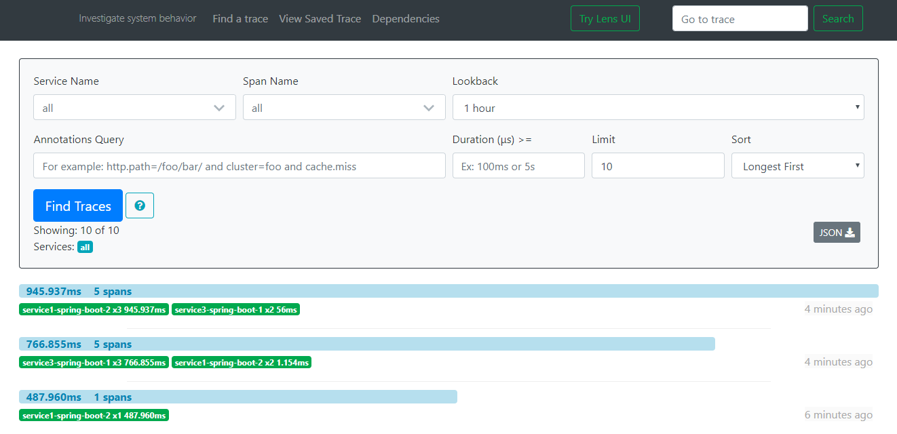
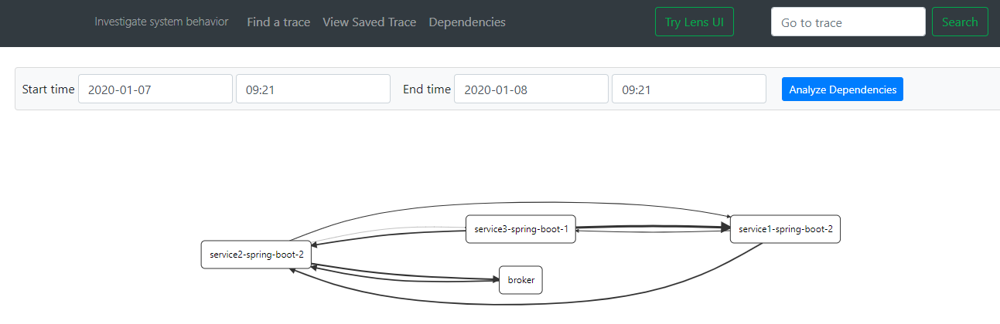
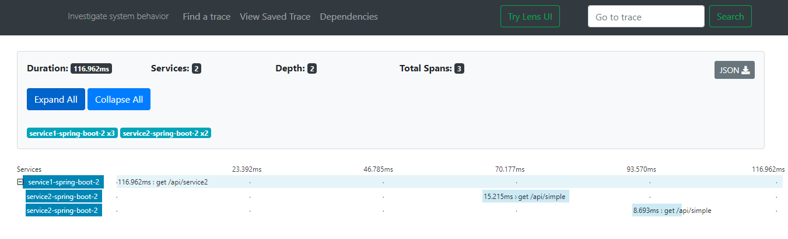

# Spring Cloud Sleuth Demo of micro-service 


#### Demo of...
> Rest API

> Kafka API

> Async

> Feign

#### Demo Log
```log
service1.log:2016-02-26 11:15:47.561  INFO [service1,2485ec27856c56f4,2485ec27856c56f4,true] 68058 --- [nio-8081-exec-1] i.s.c.sleuth.docs.service1.Application   : Hello from service1. Calling service2
service2.log:2016-02-26 11:15:47.710  INFO [service2,2485ec27856c56f4,9aa10ee6fbde75fa,true] 68059 --- [nio-8082-exec-1] i.s.c.sleuth.docs.service2.Application   : Hello from service2. Calling service3 and then service4
service3.log:2016-02-26 11:15:47.895  INFO [service3,2485ec27856c56f4,1210be13194bfe5,true] 68060 --- [nio-8083-exec-1] i.s.c.sleuth.docs.service3.Application   : Hello from service3
service2.log:2016-02-26 11:15:47.924  INFO [service2,2485ec27856c56f4,9aa10ee6fbde75fa,true] 68059 --- [nio-8082-exec-1] i.s.c.sleuth.docs.service2.Application   : Got response from service3 [Hello from service3]
service4.log:2016-02-26 11:15:48.134  INFO [service4,2485ec27856c56f4,1b1845262ffba49d,true] 68061 --- [nio-8084-exec-1] i.s.c.sleuth.docs.service4.Application   : Hello from service4
service2.log:2016-02-26 11:15:48.156  INFO [service2,2485ec27856c56f4,9aa10ee6fbde75fa,true] 68059 --- [nio-8082-exec-1] i.s.c.sleuth.docs.service2.Application   : Got response from service4 [Hello from service4]
service1.log:2016-02-26 11:15:48.182  INFO [service1,2485ec27856c56f4,2485ec27856c56f4,true] 68058 --- [nio-8081-exec-1] i.s.c.sleuth.docs.service1.Application   : Got response from service2 [Hello from service2, response from service3 [Hello from service3] and from service4 [Hello from service4]]
```
###### Kibana


## Micro Service 1 (Spring Boot 2)
> Kafka 

> Rest Api

> Async

> Feign

###### Run
> Run `Server1Sb2Application.java` from project
> Go to url: `http://localhost:8080/swagger-ui.html` (default port can be change from properties)

####### Issues
> Default @Async supported

> Custom @Async process add LazyTraceExecutor instead of ThreadPoolTaskExecutor

## Micro Service 2 (Spring Boot 2)
> Rest

> Kafka Stream Binder

###### Run
> Run `Server2Sb2Application.java` from project
> Go to url: `http://localhost:8081/swagger-ui.html` (default port can be change from properties)

## Micro Service 3 (Spring Boot 1)
> Kafka

> Rest Api

> Feign

####### Issues
> Spring Boot 1 no interceptor of tracing to RestTemplateBuilder (No Customizer Bean) (Working with @Autowire on list restTemplate, need use TraceRestTemplateInterceptor manually)
> 'no.sysco.middleware.kafka:kafka-interceptor-zipkin:0.4.2' not support spring boot 1

###### Run
> Run `Server3Sb1Application.java` from project
> Go to url: `http://localhost:8082/swagger-ui.html` (default port can be change from properties)


### Spring Log Output of Sleuth
####### Default
```yaml
logging:
  pattern:
    level: '%5p [${spring.application.name},%X{X-B3-TraceId},%X{X-B3-SpanId},%X{X-Span-Export}]'
```

#### For disable send to Zipkin Server in Spring Boot Application
```yaml
spring.zipkin.enabled: false
```

## [Zipkin](https://zipkin.io/)
> Zipkin is a distributed tracing system. It helps gather timing data needed to troubleshoot latency problems in service architectures. 
> Features include both the collection and lookup of this data.

### Run Zipkin Server

###### 1. Run From Project
> Run `Server4ZipkinApplication.java` from project, not support from new versions.

###### 2. Run From JAR
> From [latest zipkin jar](https://search.maven.org/remote_content?g=io.zipkin.java&a=zipkin-server&v=LATEST&c=exec). 
> Once you have downloaded this jar using the command prompt run the execute jar command as follows
> java -jar <jar_name>

###### Docker 
[Zipkin docker image](https://hub.docker.com/r/openzipkin/zipkin/) 

#### Open Zipkin
> Go to url: `http://localhost:9411` (default port can be change from properties)





#### Support different Language/Framework
[Support Libraries](https://zipkin.io/pages/tracers_instrumentation.html)

#### Book
[distributed-tracing-with-spring-cloud-sleuth-and-zipkin](https://livebook.manning.com/book/exploring-microservice-development/2-chapter-9-distributed-tracing-with-spring-cloud-sleuth-and-zipkin/)

#### Example
[example](https://www.javainuse.com/spring/cloud-sleuth)


#### What Next...
> Build/Integrate with Python project